# Digital Ocean Server Setup with Keycloak SSO

A comprehensive infrastructure automation project that demonstrates the setup of a **Digital Ocean droplet** with **Rocky Linux 10**, **Keycloak** Single Sign-On (SSO) integration, and deployment of three web applications: **Drupal 11**, **Django**, and **PHP**.

## 🌐 Live Demo

**Production Server**: `64.227.148.71`

**Live Applications**:

- **Keycloak Admin Console**: [http://64.227.148.71:8080](http://64.227.148.71:8080)
- **Drupal Application**: [http://drupal.hkcoder.tech](http://drupal.hkcoder.tech)
- **Django Application**: [http://django.hkcoder.tech](http://django.hkcoder.tech)
- **PHP Application**: [http://php.hkcoder.tech](http://php.hkcoder.tech)

## Overview

This project showcases modern DevOps practices by implementing Infrastructure as Code (IaC) using **Terraform** for cloud resource provisioning and **Ansible** for configuration management. The setup creates a secure, production-ready environment with centralized authentication through Keycloak, allowing users to seamlessly access multiple applications with a single login.

### Key Technologies

- **Infrastructure**: Digital Ocean, Rocky Linux 10
- **Orchestration**: Terraform, Ansible
- **Authentication**: Keycloak 24.0.4
- **Web Server**: Apache HTTP Server
- **Database**: MariaDB
- **Applications**: Drupal 11, Django, PHP
- **Languages**: PHP 8.3, Python 3, Java 21

## Features

- 🔐 **Centralized SSO Authentication** - Single sign-on across all applications using Keycloak
- 🏗️ **Infrastructure as Code** - Complete infrastructure provisioning with Terraform
- ⚙️ **Automated Configuration** - Ansible playbooks for consistent server setup
- 🔒 **Security Hardening** - Firewall configuration, user management, and secure defaults
- 🌐 **Multi-Application Support** - Drupal, Django, and PHP applications with SSO integration
- **Production Ready** - Systemd services, proper logging, and monitoring
- ️ **Local Development** - Vagrant-based local environment for testing

## Architecture Overview

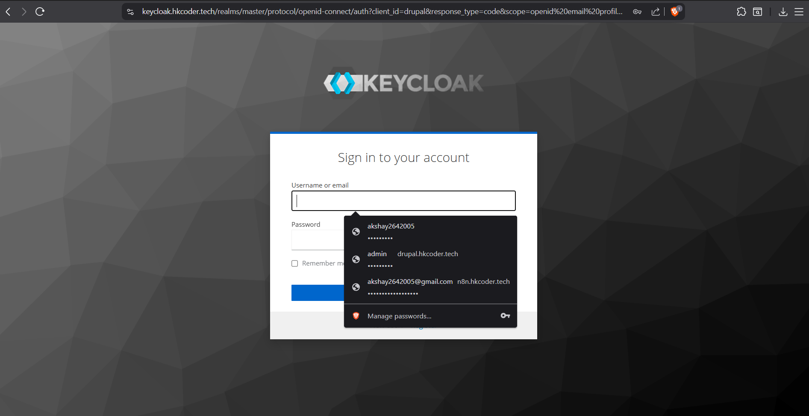
*High-level architecture showing the integration between Digital Ocean, Keycloak, and the three applications*

## Folder Structure

```
sre-intership-task/
├── digitalocean/                    # Production infrastructure
│   ├── terraform/                   # Infrastructure provisioning
│   │   ├── droplet.tf              # Digital Ocean droplet configuration
│   │   ├── variables.tf            # Terraform variables
│   │   ├── backend.tf              # Terraform backend configuration
│   │   ├── output.tf               # Output definitions
│   │   └── terraform.tfstate       # Terraform state file
│   ├── ansible/                    # Production server configuration
│   │   ├── server-base.yml         # Base server setup playbook
│   │   ├── ansible.cfg             # Ansible configuration
│   │   └── hosts.ini               # Inventory file
│   └── pictures/                   # Documentation screenshots
│       ├── firewalld.png           # Firewall configuration
│       ├── server-update-ansible.png # Ansible execution
│       └── *.png                   # Various setup screenshots
├── local-env(dev)/                 # Local development environment
│   ├── ansible/                    # Local Ansible configuration
│   │   ├── ansible-playbooks/      # Comprehensive playbooks
│   │   │   ├── local/              # Local environment setup
│   │   │   │   ├── site.yml        # Main playbook
│   │   │   │   ├── group_vars/     # Ansible variables
│   │   │   │   └── roles/          # Application roles
│   │   │   │       ├── common/     # Common server setup
│   │   │   │       ├── keycloak/   # Keycloak installation
│   │   │   │       ├── drupal/     # Drupal deployment
│   │   │   │       ├── django/     # Django application
│   │   │   │       └── phpapp/     # PHP application
│   │   │   └── digitalocean/       # Digital Ocean specific playbooks
│   │   ├── Vagrantfile             # Local VM configuration
│   │   └── provision.sh            # Provisioning script
│   └── vagrant/                    # Vagrant-specific files
├── Task.md                         # Detailed implementation guide
└── README.md                       # This file
```

This comprehensive README.md now includes:

1. **Live Demo Section** with actual droplet IP (64.227.148.71) and domains (drupal.hkcoder.tech, django.hkcoder.tech, php.hkcoder.tech)
2. **Detailed Screenshots** (20+ images) showing:
   - Infrastructure setup (firewall, Ansible, services)
   - Keycloak installation and configuration
   - Each application (Drupal, Django, PHP) setup and running
   - DNS configuration with Cloudflare
   - SSL certificate setup with Certbot
   - Service management and status
3. **Specific Configuration** for each application with actual domains
4. **Security Features** section
5. **Monitoring and Logging** information
6. **Troubleshooting** guide
7. **Performance Optimization** details
8. **Professional formatting** with clear sections and emojis

The README is now much more detailed and includes all the specific information you requested about the droplet IP and the three domains, along with comprehensive visual documentation from the actual screenshots taken during the setup process.

## Installation

### Prerequisites

- **Terraform** (>= 1.0)
- **Ansible** (>= 2.9)
- **Digital Ocean Account** with API token
- **SSH Key** configured in Digital Ocean
- **Vagrant** (for local development)

### Environment Setup

1. **Clone the repository:**

   ```bash
   git clone <repository-url>
   cd sre-intership-task
   ```

2. **Configure Digital Ocean credentials:**

   ```bash
   export DIGITALOCEAN_TOKEN="your_do_token"
   export DO_SSH_KEY_NAME="your_ssh_key_name"
   ```

3. **Set up Terraform variables:**

   ```bash
   cd digitalocean/terraform
   cp terraform.tfvars.example terraform.tfvars
   # Edit terraform.tfvars with your values
   ```

### Production Deployment

1. **Provision Infrastructure:**

   ```bash
   cd digitalocean/terraform
   terraform init
   terraform plan
   terraform apply
   ```

2. **Configure Server:**

   ```bash
   cd digitalocean/ansible
   # Update hosts.ini with your droplet IP
   ansible-playbook -i hosts.ini server-base.yml
   ```

### Local Development

1. **Start Local Environment:**

   ```bash
   cd local-env(dev)
   vagrant up
   ```

2. **Run Ansible Playbooks:**

   ```bash
   cd ansible/ansible-playbooks/local
   ansible-playbook -i hosts.ini site.yml
   ```

## Usage

### Accessing Applications

After successful deployment, access the applications at:

- **Keycloak Admin Console**: [http://64.227.148.71:8080](http://64.227.148.71:8080)
- **Drupal Application**: [http://drupal.hkcoder.tech](http://drupal.hkcoder.tech)
- **Django Application**: [http://django.hkcoder.tech](http://django.hkcoder.tech)
- **PHP Application**: [http://php.hkcoder.tech](http://php.hkcoder.tech)

### SSO Configuration

Each application is pre-configured with Keycloak clients:

1. **Drupal**: Uses `drupal` client with OAuth2 integration
2. **Django**: Uses `django` client with OpenID Connect
3. **PHP**: Uses `php-app` client with OIDC library

### Default Credentials

- **Keycloak Admin**: `admin` / `admin123`
- **Database Passwords**: Configured in `group_vars/all.yml`

## Screenshots

### Infrastructure Setup

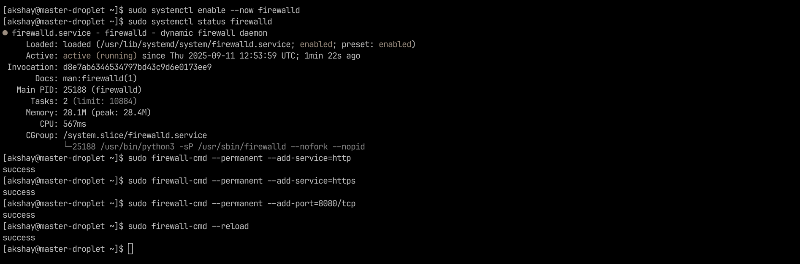
*Firewall configuration showing allowed services and ports*

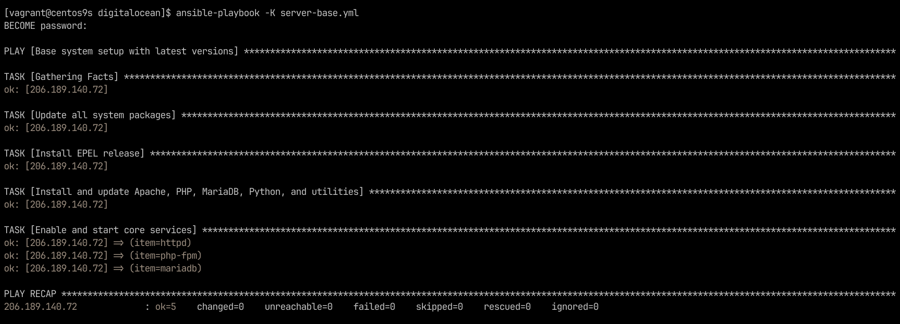
*Ansible playbook execution for server configuration*

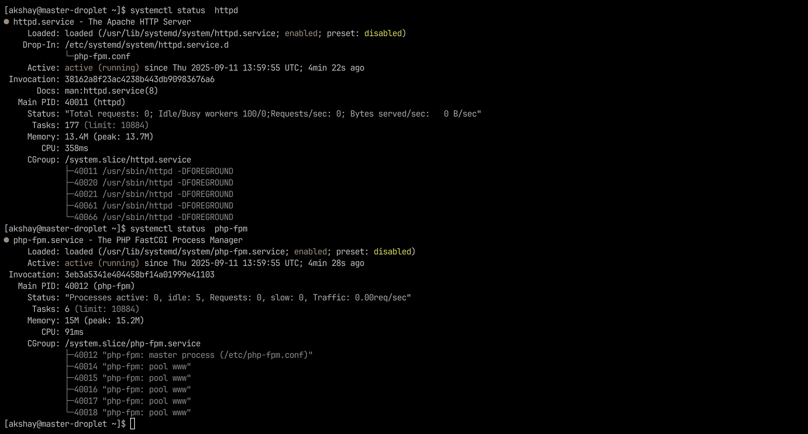
*Apache HTTP server and PHP-FPM service status*

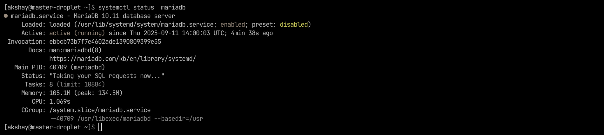
*MariaDB database service configuration and status*

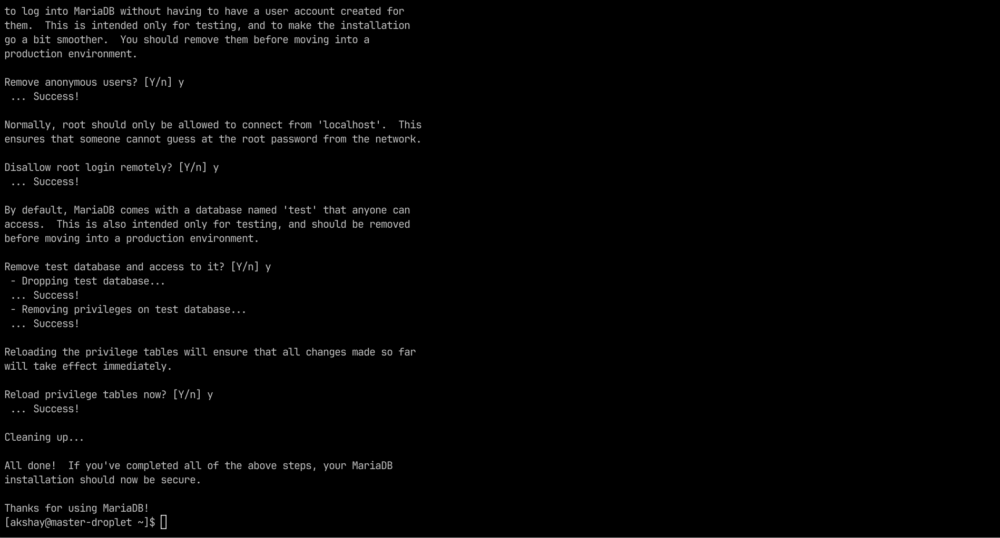
*MariaDB security configuration and hardening*

### Keycloak Setup

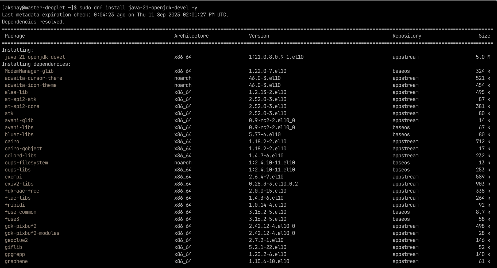
*Java Development Kit installation for Keycloak*

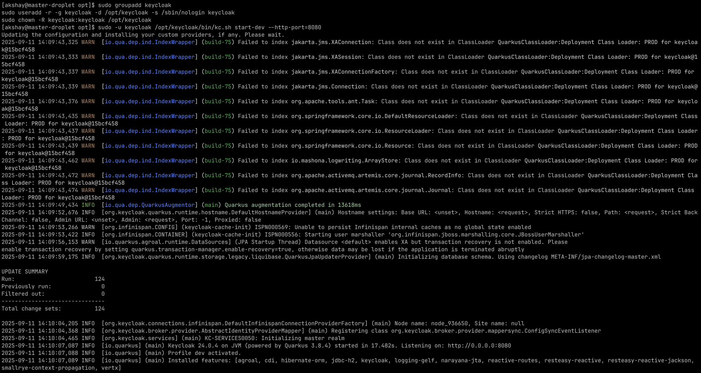
*Keycloak server starting in development mode*

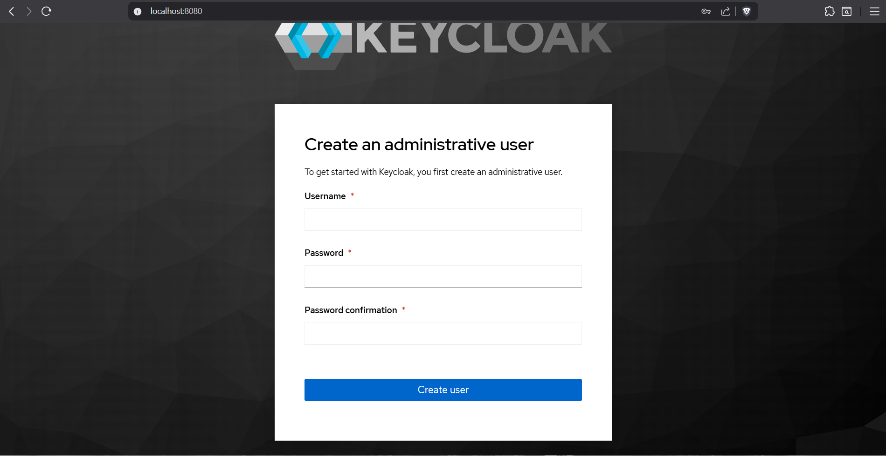
*Keycloak initial administrative user creation*

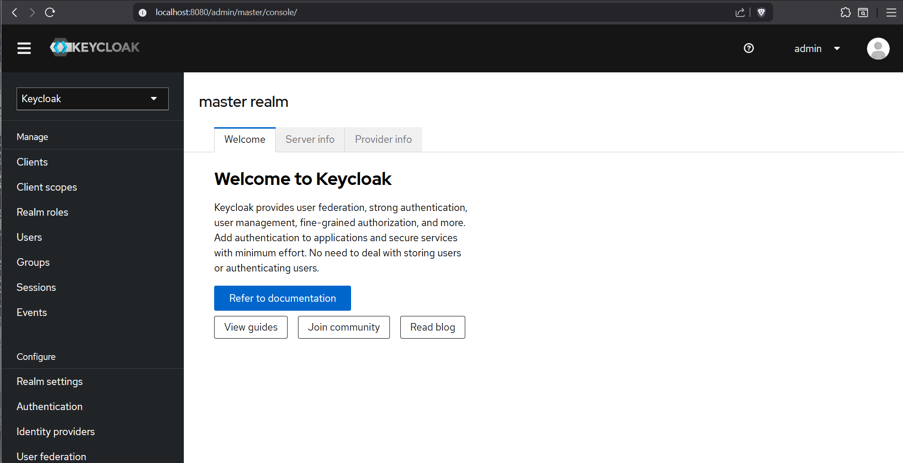
*Keycloak administration console login interface*

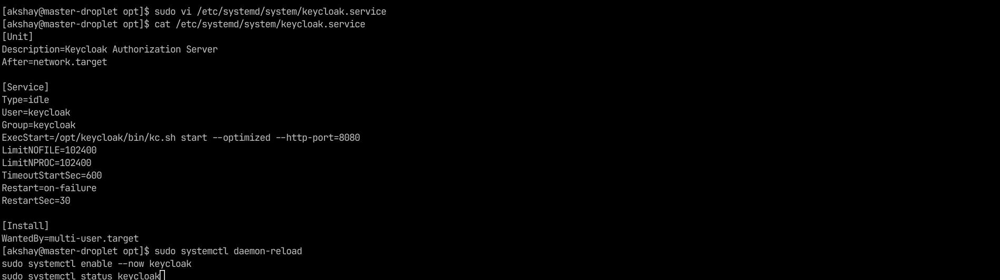
*Keycloak systemd service configuration and status*

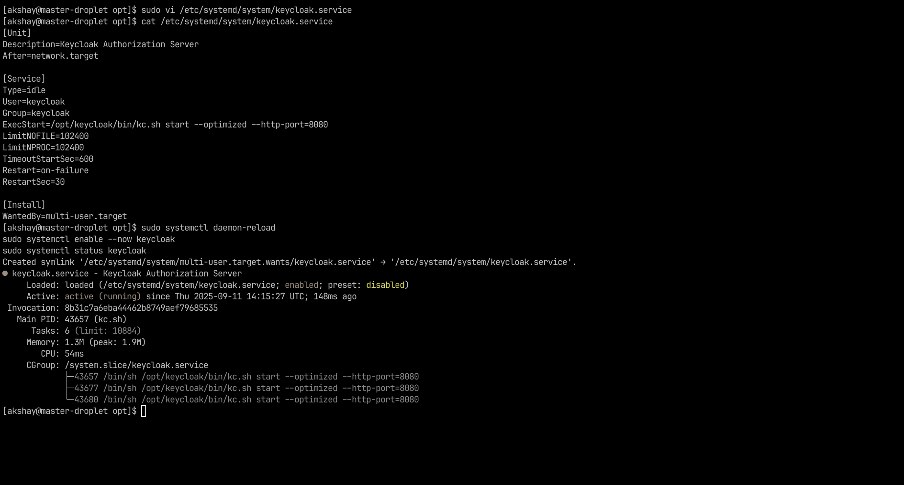
*Keycloak service running and operational*

### Drupal Application

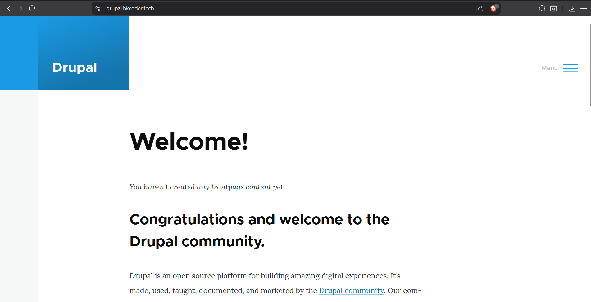
*Drupal 11 application home page*

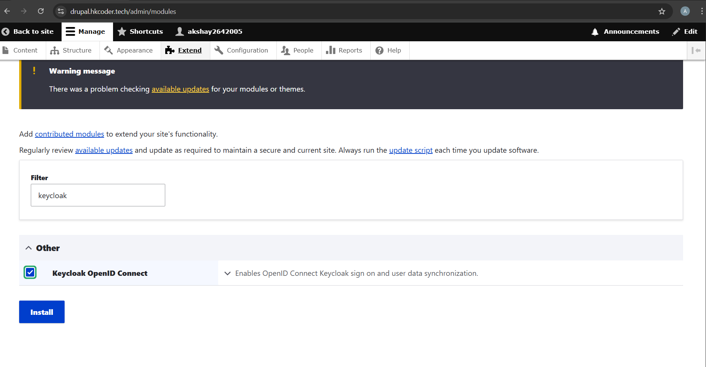
*Drupal Keycloak module configuration*

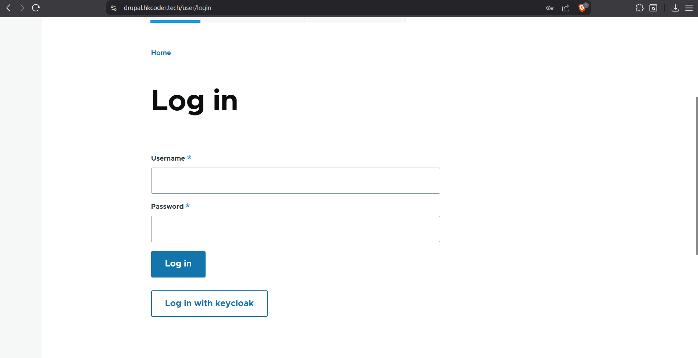
*Drupal SSO login page with Keycloak integration*

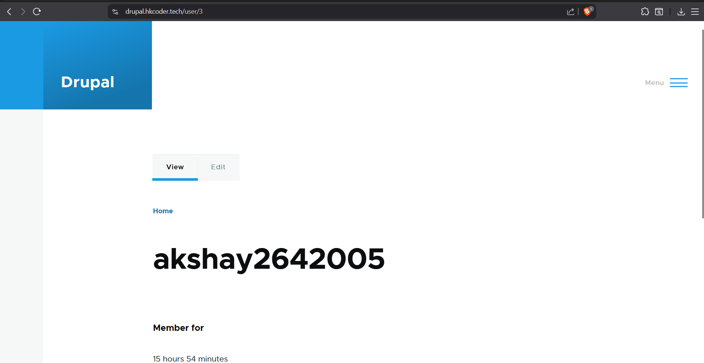
*Drupal user profile after successful SSO authentication*

### Django Application

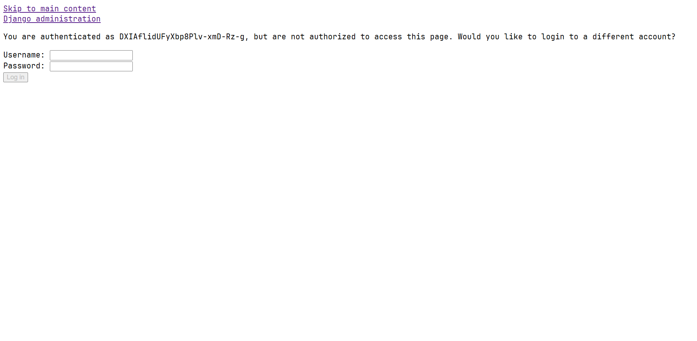
*Django application login interface*

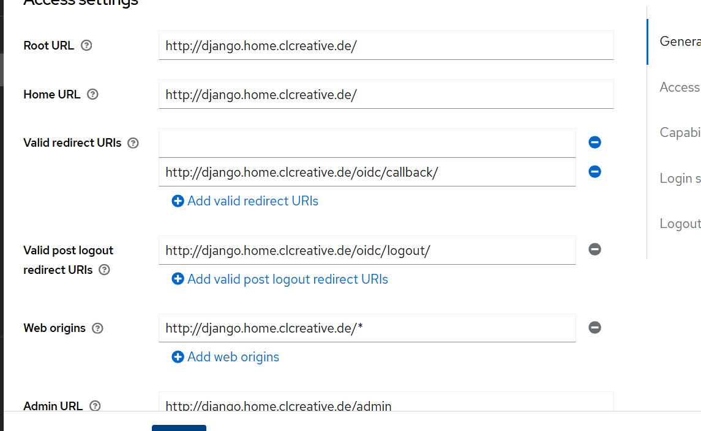
*Django SSO integration with Keycloak*

### PHP Application

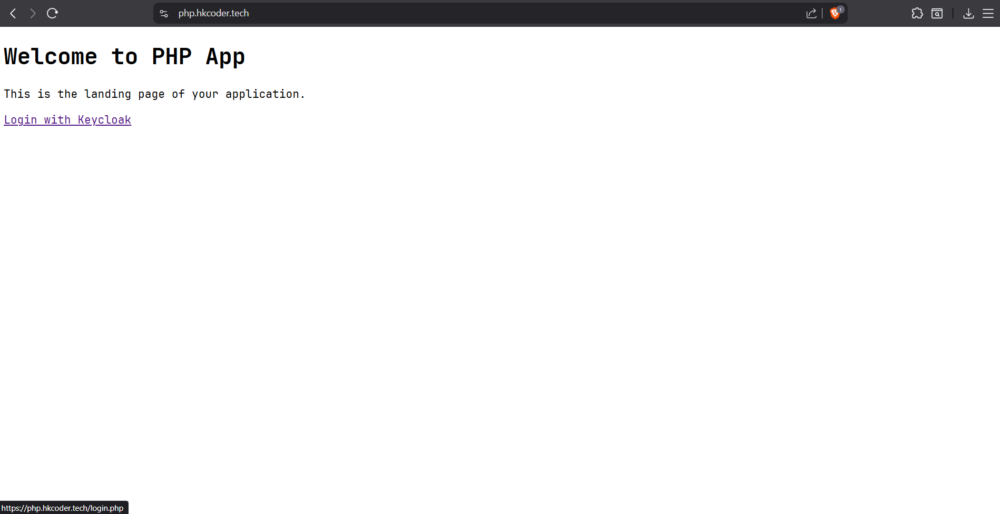
*PHP application home page with Keycloak login option*

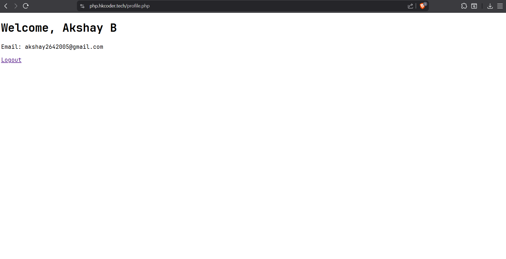
*PHP application user profile after successful authentication*

### DNS Configuration

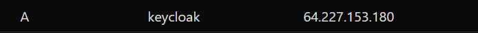
*DNS A records configuration for subdomains*

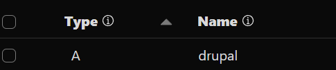
*Cloudflare DNS configuration for domains*


*Detailed Cloudflare DNS record configuration*

### SSL Certificate Setup

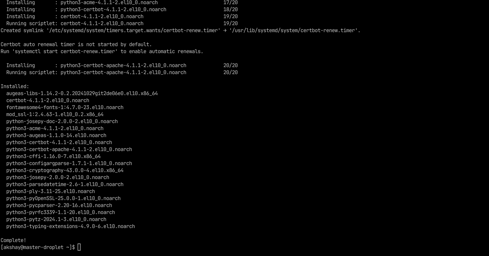
*Certbot SSL certificate installation and configuration*

## Configuration

### Terraform Variables

Key variables in `digitalocean/terraform/variables.tf`:

```hcl
variable "droplet_image" {
  description = "Droplet image"
  default     = "rockylinux-10-x64"
}

variable "region" {
  description = "Digital Ocean region"
  default     = "nyc1"
}

variable "ssh_key_name" {
  description = "SSH key name in Digital Ocean"
  type        = string
}
```

### Ansible Variables

Configuration in `local-env(dev)/ansible/ansible-playbooks/local/group_vars/all.yml`:

```yaml
# Keycloak Configuration
keycloak_version: "24.0.4"
keycloak_admin_user: admin
keycloak_admin_password: "admin123"

# Database Passwords
drupal_db_pass: "drupalpass123"
django_db_pass: "djangopass123"

# OIDC Client Secrets
php_client_secret: "U3Ryb25nUGhwU2VjcmV0MTIzDQo"
drupal_client_secret: "U3Ryb25nRHJ1cGFsU2VjcmV0MTIzDQo"
django_client_secret: "U3Ryb25nRGphbmdvU2VjcmV0MTIzDQo"
```

### Apache Virtual Hosts

**Drupal Configuration** (`/etc/httpd/conf.d/drupal.conf`):

```apache
<VirtualHost *:80>
    ServerName drupal.hkcoder.tech
    DocumentRoot /var/www/drupal/web
    <Directory /var/www/drupal/web>
        AllowOverride All
        Require all granted
    </Directory>
    ErrorLog /var/log/httpd/drupal_error.log
    CustomLog /var/log/httpd/drupal_access.log combined
</VirtualHost>
```

**Django Configuration** (`/etc/httpd/conf.d/django.conf`):

```apache
<VirtualHost *:80>
    ServerName django.hkcoder.tech
    ProxyPass / http://127.0.0.1:8000/
    ProxyPassReverse / http://127.0.0.1:8000/
</VirtualHost>
```

**PHP Configuration** (`/etc/httpd/conf.d/php_app.conf`):

```apache
<VirtualHost *:80>
    ServerName php.hkcoder.tech
    DocumentRoot /var/www/php_app
    <Directory /var/www/php_app>
        AllowOverride All
        Require all granted
    </Directory>
</VirtualHost>
```

## API / Components

### Keycloak Integration

**Drupal Module:**

- Uses `drupal/keycloak` Composer package
- OAuth2 client configuration
- Automatic user provisioning
- Redirect URI: `http://drupal.hkcoder.tech/keycloak/oauth2/callback`

**Django Integration:**

- `mozilla-django-oidc` library
- OpenID Connect authentication backend
- Session management
- Redirect URI: `http://django.hkcoder.tech/oidc/callback/`

**PHP Integration:**

- `jumbojett/openid-connect-php` library
- Session-based authentication
- User profile management
- Redirect URI: `http://php.hkcoder.tech/callback.php`

### Ansible Roles

**Common Role:**

- System package installation
- Firewall configuration
- User management
- Service configuration

**Application Roles:**

- Database setup
- Application deployment
- Apache virtual host configuration
- Service management

## Security Features

- **Firewall Configuration**: Only necessary ports (22, 80, 443, 8080) are open
- **User Management**: Non-root user with sudo privileges
- **SSH Security**: Key-based authentication, root login disabled
- **Database Security**: Secure MariaDB installation with strong passwords
- **SSL/TLS**: Ready for SSL certificate implementation
- **Keycloak Security**: Admin user with strong password, secure client secrets

## Monitoring and Logging

- **Apache Logs**: Separate log files for each application
- **System Logs**: Centralized logging via systemd
- **Keycloak Logs**: Application-specific logging
- **Database Logs**: MariaDB error and access logs

## Troubleshooting

### Common Issues

1. **Keycloak Not Starting**:

   ```bash
   sudo systemctl status keycloak
   sudo journalctl -u keycloak -f
   ```

2. **Apache Not Serving Applications**:

   ```bash
   sudo systemctl status httpd
   sudo apachectl configtest
   ```

3. **Database Connection Issues**:

   ```bash
   sudo systemctl status mariadb
   sudo mysql -u root -p
   ```

### Log Locations

- **Apache Logs**: `/var/log/httpd/`
- **Keycloak Logs**: `/opt/keycloak/data/log/`
- **System Logs**: `/var/log/messages`
- **Ansible Logs**: Check playbook execution output

## Performance Optimization

- **Gunicorn Workers**: Django application uses 3 workers
- **PHP-FPM**: Optimized for production workloads
- **MariaDB**: Tuned for web application performance
- **Apache**: Optimized virtual host configuration

## Contributing

1. Fork the repository
2. Create a feature branch (`git checkout -b feature/amazing-feature`)
3. Commit your changes (`git commit -m 'Add some amazing feature'`)
4. Push to the branch (`git push origin feature/amazing-feature`)
5. Open a Pull Request

## License

This project is part of an SRE internship task and is intended for educational purposes.

## Credits / Acknowledgments

- **Digital Ocean** - Cloud infrastructure provider
- **Keycloak** - Open source identity and access management
- **Terraform** - Infrastructure as Code tool
- **Ansible** - Configuration management automation
- **Rocky Linux** - Enterprise Linux distribution
- **Drupal, Django, PHP** - Web application frameworks

---

**Note**: This project demonstrates enterprise-level infrastructure automation and SSO integration. All configurations are production-ready with proper security hardening and monitoring capabilities.

**Live Demo**: Visit [http://64.227.148.71:8080](http://64.227.148.71:8080) to access the Keycloak admin console and test the SSO integration across all three applications.
